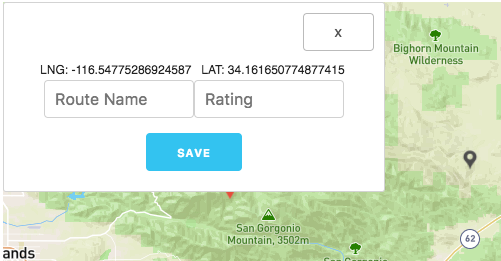

# Route Finder

A user generated rock climbing route finder. Looking for a route to climb? Found a route and want to share it? Route Finder helps people from all over the globe share routes and make their search for the perfect climb easier!

Get started here:

[Client Link](https://climb-finder.herokuapp.com/)

[Client Git Link](https://github.com/karinchung/route-finder)

[Server Link ](https://glacial-cliffs-19468.herokuapp.com/)

[Server Git Link](https://github.com/karinchung/route-finder-server)

## How to Use

Anyone can see all of the routes that users have input into the site.

**Adding a Route**

To add your own route you must have an account.

Once you have an account simply click on the map and a marker and modal will appear with your potential route details.

You can name your route and give it a rating before submitting it.

Now anyone can click on the new route marker (official when it's indicated in red instead of grey) and see your route details.

**Deleting and Editing a Route**

Only the site admin can delete or edit routes. To request that your route be deleted or edited please contact us. This is done to preserve and mantain routes that users are looking out for.

## User Stories

**MVP**

- Full CRUD on a map API
- Creating your own routes
- User authentication

**Feature Log**

- Favorites Page
- The ability to create a task lisk of routes

## Technologies

**Backend:** Node.js | Express | Mongo | Javascript Web Tokens

**Frontend:** React | Axios | Skeleton CSS 

## Shoutouts

This project was bootstrapped with [Create React App](https://github.com/facebookincubator/create-react-app).

This product has minimum css with [Skeleton](http://getskeleton.com/).

This product utilizes the [Mapbox Api](https://www.mapbox.com/) to accomplish all cool map functionalities.

This project uses a React wrapper for Mapbox made by [alex3165](https://github.com/alex3165/react-mapbox-gl).

This app knows where you are with [node-geocoder](https://www.npmjs.com/package/node-geocoder)

This product has an awesome icon with [Font Awesome](http://fontawesome.io/)